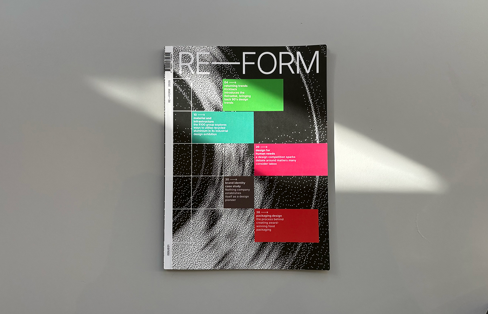
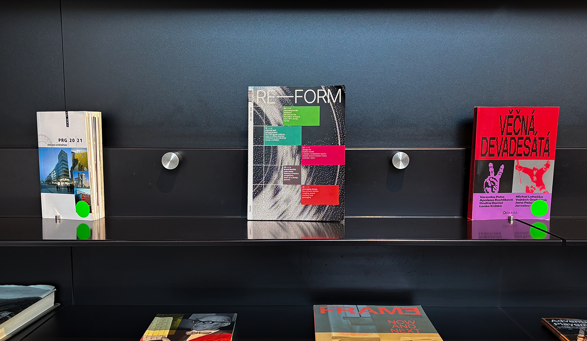

# RE–FORM case study
Creating unique designs in a world of factory manufacutring is a difficult task. Creators who design beyond what is already established drive the creative space forward. It was our task to curate examples of innovative product design and create a magazine that would celebrate it.

## BOLD YET VERSATILE – *the need for an accomodating system*	
Having gathered source material for our articles, it became clear that the designs vary widely. Some are bold and experimental, others minimal and utilitarian. In order to create a unified design for our magazine we would need a system that would:
-	Work well with content of different styles
-	Allow for some degree of customisation
-	Still look cohesive and contemporary
  
It was my task to design a series of layouts that will be able to accomodate our needs. I created several layout variats that can be repeated with some variation throughout the magazine. These serve as a base that can be taken into any creative direction with a few adjustments.

##INVISIBLE & EXPRESSIVE TYPE
Wanting a clear visual hierarchy, we set up a simple typographic system. Our body type would be a neutral, readable font complimented by expressive display fonts used in headlines. These display fonts would vary by article, adding visual interest and matching the vibe of each article.
I took up the taks of selecting a fitting body font. After careful consideration I arrived at inter, a neutral, fresh feeling font of the 21. century. Several paragraph styles were created with both readability and aesthetics in mind.

##CONTRASTING COLOR & TEXTURE
One thing was clear to us from the start, we wanted our magazine to attract attention. Using vibrant colors and interesting visuals was a way to achieve that. I created a set of bitmap images from our source photos. They reveal hidden patterns in various materials, creating abstract art pieces. These were then used throughout the issue, such as on the cover and before every article.
Each article was given a dominant color, typically that of the product. Using these throughout the article essentially color coded the magazine. From this, a system emerged. We repeated this color scheme on the cover, creating an index.
##THE COVER
Our whole design culminated itself in our cover. 
