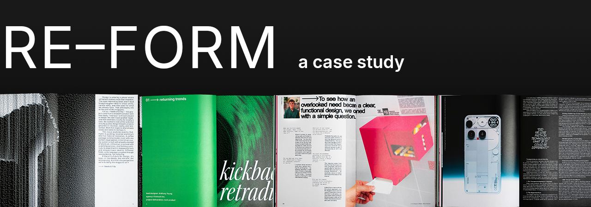
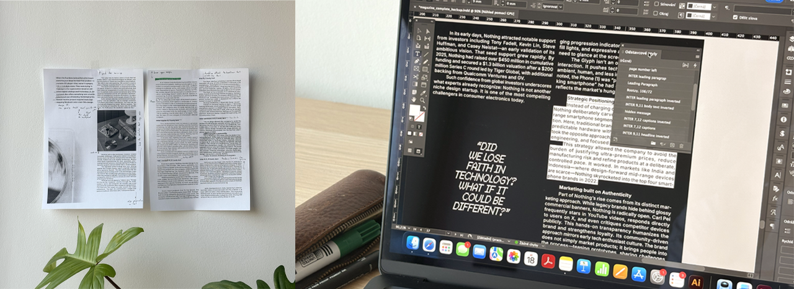
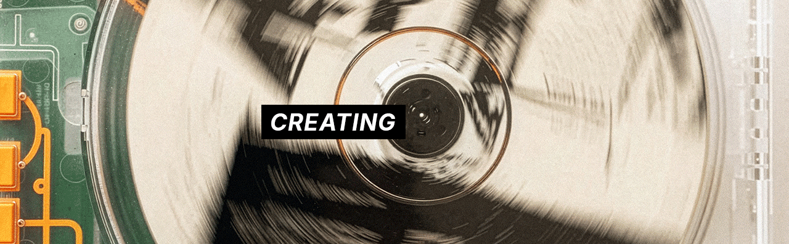
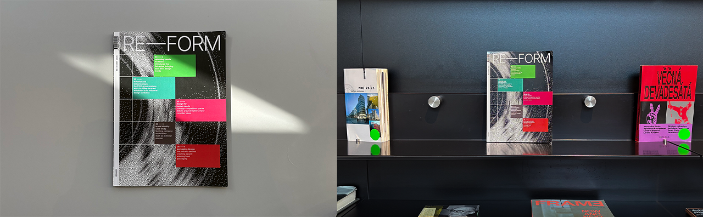

### The task :memo:
Creating unique designs in a world of factory manufacutring is a difficult task. Creators who design beyond what is already established drive the creative space forward. It was our task to curate examples of innovative product design and create a magazine that would celebrate it.

## BOLD YET VERSATILE – *the need for an accomodating system*	
Having gathered source material for our articles, it became clear that the designs vary widely. Some are bold and experimental, others minimal and utilitarian. In order to create a unified design for our magazine we would need a system that:
-	Works well with content of different styles
-	Allows for some degree of customisation
-	Still looks cohesive and contemporary
  
Turning this into a layout system was my task. I created several page layouts that can be repeated with some variation throughout the magazine. They are a base that can be taken into any creative direction with a few adjustments.

## INVISIBLE & EXPRESSIVE TYPE
Wanting a clear visual hierarchy, we set up a simple typographic system. Our body type would be a neutral, readable font complimented by expressive display fonts used in headlines. These display fonts would vary by article, adding visual interest and matching the vibe of each article.
I took up the taks of selecting a fitting body font. After careful consideration I arrived at inter, a neutral, fresh feeling font of the 21. century. Several paragraph styles were created with both readability and aesthetics in mind.

Several versions were printed to ensure our designs worked well on paper.

## CONTRASTING COLOR & TEXTURE
To create a striking design we used vibrant colors and interesting visuals. I created a set of bitmap images from our source photos. They reveal hidden patterns in various materials, creating abstract art pieces. These were then used throughout the issue as well as on the cover.

Turning interesting textures into bitmaps is the basis of our abstract visuals.

Each article was given a dominant color, typically that of the product. Using these throughout the article essentially color coded the magazine. From this, a system emerged. We repeated this color scheme on the cover, creating an index.

## A STRIKING COVER & PRINTING
Our whole design culminated itself in a cover. The cover utilises all the techniques used throughout the issue. The colors and the bitmaps are mixed to create a design that's cohesive with the rest of the issue. 

## RESULTS
To test how customers would respond to our design, a small scale test was conducted. Issues of the magazine were passed around and we collected feedback. From the feedback we gathered the following kept being repeated:
-	the bitmap patterns gave the design an edge
-	the cover stands out among other design focused megazines
-	Each article having its own font was praised

### designer feedback
A copy was also sent to several of the designers featured in the magazine, their feedback was also very positive and they welcomed further collaboration with RE–FORM. 
