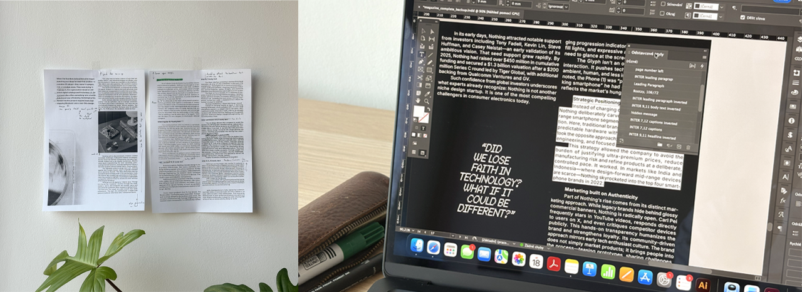
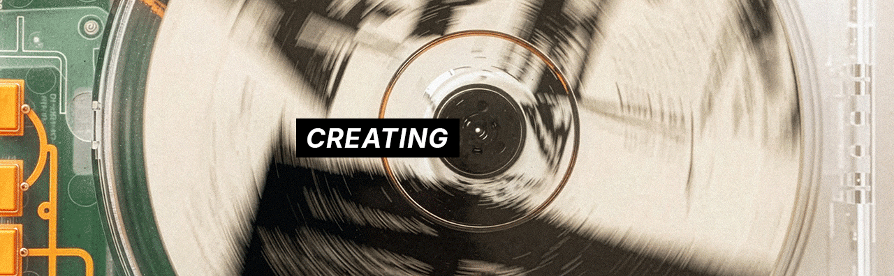

# THE NEED FOR PASSION PROJECTS
It has been exactly a year since I began working on a project that helped me follow my dream. In this year I learned the importance of personal work - projects that drive us forward, projects that tell the world who we are. As the project nears completion, all the hard work that went into it starts to show. 

## MY (*OVERLY*)	AMBITIOUS PROJECT
With a deep appreciation for the world's oceans, I dreamed of developing an indie game that would, through its immersiveness, allow others to see the ocean from my perspective – a stunning ecosystem worth protecting. It became clear that this was a difficult task, as game development demands knowledge of various fields, such as:

-	3d art and animation
-	programming and optimisation 
-	gamification
-	sound design, marketing, etc.

As the scope of the project grew, so did my worries. At times, things did go wrong, stuff broke. As I pushed through though, I realised that the thing that kept me going was the passion behind this project. The drive allowed me to keep going and accomplish things that seemed impossible just a year ago.

## THE PASSION BEHIND THE PROJECT
I was fascinated by the ocean ever since I was little. Coming from a landlocked country paints the sea as something rare, something you maybe get to visit once a year for vacation. This just makes it that more alluring.

Things have changed since I was a kid, some for the better – I've had the privilege of travelling to far away places. I could finally explore the colorful reefs of the indopacific. Underneath the surface was a world so unlike anything on land – swaying coral, colorful schools of fish and gentle giants that demand respect. 

Some things however, have changed for the worse. Climate change is not some abstract concept anymore, I've seen dead coral reefs first-hand. The sight of white coral skeletons is a shocking one. The world's most vibrant and lively ecosystems are the first ones to be affected by this crisis. It is this fact, that drove me to create this project. 

I find tropical seas to be the most stunning places on Earth, and the threats they face mean that we need to value them that much more. 

Several versions were printed to ensure our designs worked well on paper.

## LEARNING THROUGH BEING CHALLENGED
game dev requires learning a large number of skills, skills that are hard to learn without strong motivation

### 3d art and animation
To create a striking design we used vibrant colors and interesting visuals. I created a set of bitmap images from our source photos. They reveal hidden patterns in various materials, creating abstract art pieces. These were then used throughout the issue as well as on the cover.

Turning interesting textures into bitmaps is the basis of our abstract visuals.

Each article was given a dominant color, typically that of the product. Using these throughout the article essentially color coded the magazine. From this, a system emerged. We repeated this color scheme on the cover, creating an index.

## A STRIKING COVER & PRINTING
Our whole design culminated itself in a cover. The cover utilises all the techniques used throughout the issue. The colors and the bitmaps are mixed to create a design that's cohesive with the rest of the issue. 

## RESULTS
To test how customers would respond to our design, a small scale test was conducted. Issues of the magazine were passed around and we collected feedback. From the feedback we gathered the following kept being repeated:
-	the bitmap patterns gave the design an edge
-	the cover stands out among other design focused megazines
-	Each article having its own font was praised

### designer feedback
A copy was also sent to several of the designers featured in the magazine, their feedback was also very positive and they welcomed further collaboration with RE–FORM. 
