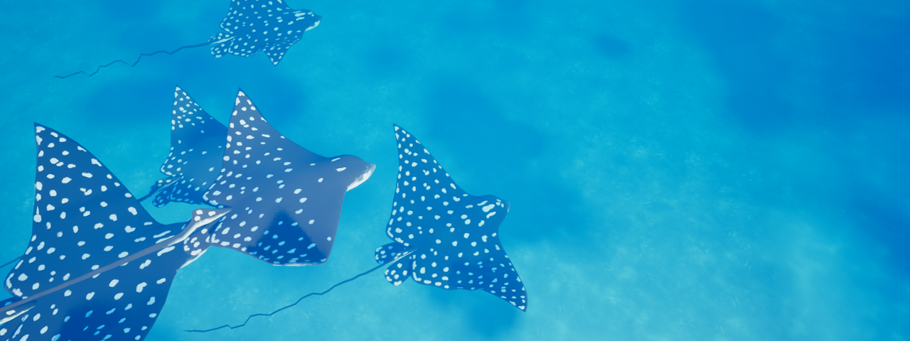
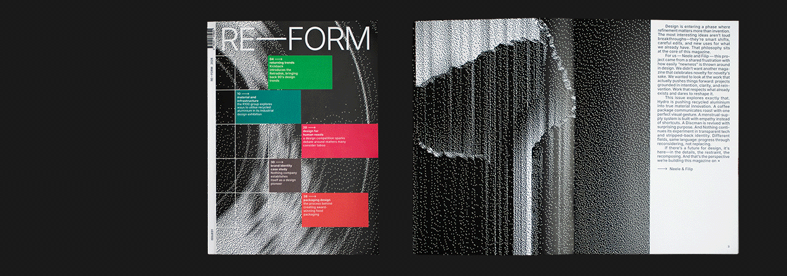
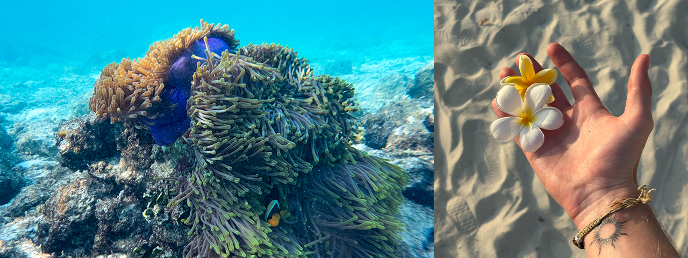
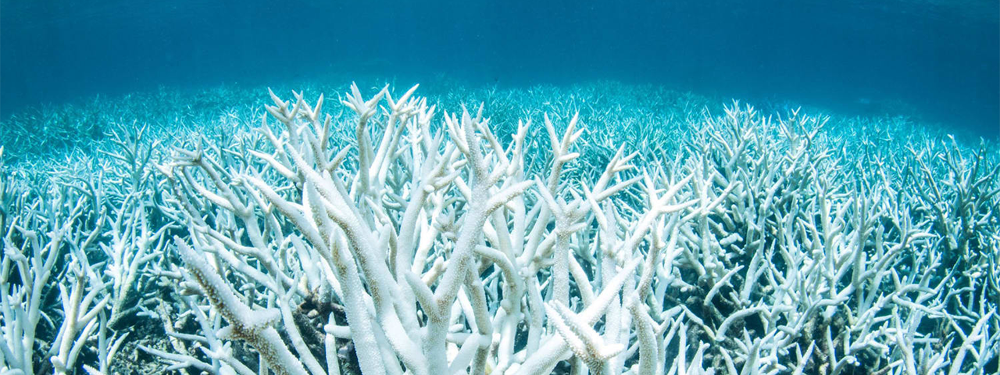
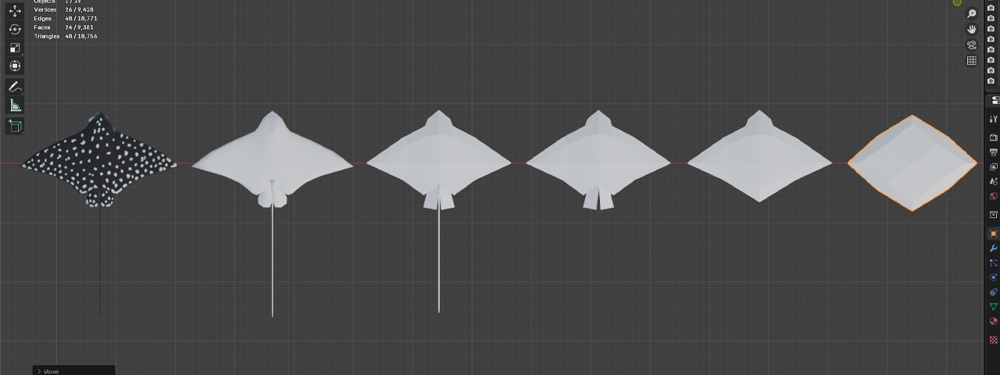
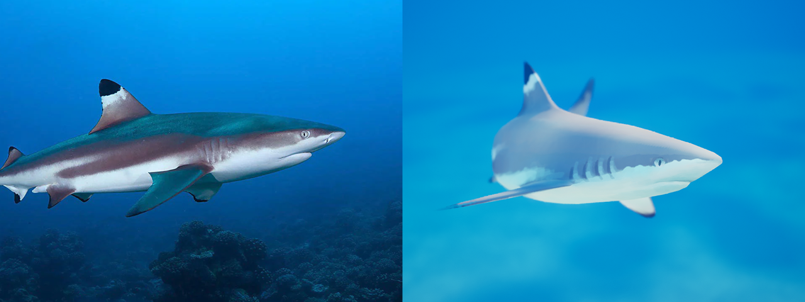
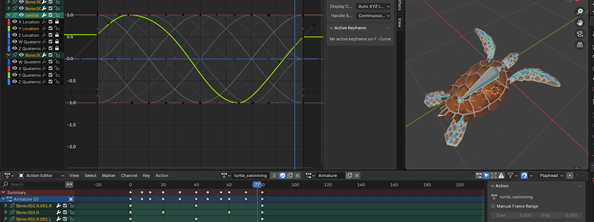
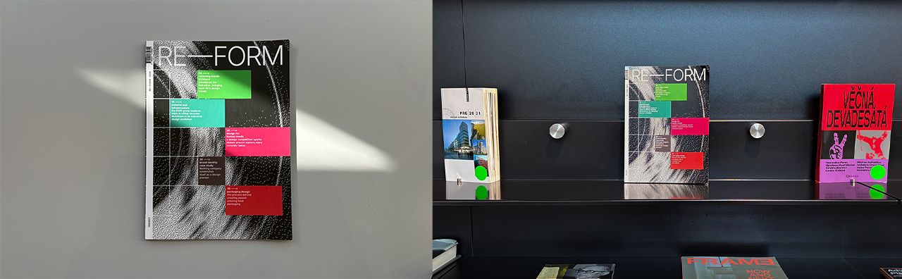

# THE NEED FOR PASSION PROJECTS
It has been exactly a year since I began working on a project that helped me follow my dream. In this year I learned the importance of personal work - projects that drive us forward, projects that tell the world who we are. As the project nears completion, all the hard work that went into it starts to show. 

## MY (*OVERLY*)	AMBITIOUS PROJECT
With a deep appreciation for the world's oceans, I dreamed of developing an indie game that would, through its immersiveness, allow others to see the ocean from my perspective – a stunning ecosystem worth protecting. It became clear that this was a difficult task, as game development demands knowledge of various fields, such as:

-	3d art and animation
-	programming and optimisation 
-	gamification
-	sound design, marketing, etc.

As the scope of the project grew, so did my worries. At times, things did go wrong, stuff broke. As I pushed through though, I realised that the thing that kept me going was the passion behind this project. The drive allowed me to keep going and accomplish things that seemed impossible just a year ago.

In its final form, the game is an immersive and relaxing experience, where you learn about various aquatic ecosystems by exploring them.

## THE PASSION BEHIND THE PROJECT
I was fascinated by the ocean ever since I was little. Coming from a landlocked country paints the sea as something rare, something you maybe get to visit once a year for vacation. This just makes it that more alluring.

Things have changed since I was a kid, some for the better – I've had the privilege of travelling to far away places. I could finally explore the colorful reefs of the indopacific. Underneath the surface was a world so unlike anything on land – swaying coral, colorful schools of fish and gentle giants that demand respect. 

Some things however, have changed for the worse. Climate change is not some abstract concept anymore, I've seen dead coral reefs first-hand. The sight of white coral skeletons is a shocking one. The world's most vibrant and lively ecosystems are the first ones to be affected by this crisis. It is this fact, that drove me to create this project. 

a reef experiencing bleaching - stress response to heat

I find tropical seas to be the most stunning places on Earth, and the threats they face mean that we need to value them that much more. 

## LEARNING THROUGH BEING CHALLENGED
game dev requires learning a large number of skills, skills that are hard to learn without strong motivation

### 3d art and animation
Creating 3d art notoriously is tough. The required workflows are convoluted and the infamously complex 3d programs do not help. It is that way for a reason though. While 3d art is hard to setup, once you do so it can be very flexible. For my game, I recreated a number of marine animals as well as foliage, starting out with simple shapes and then adding complexity. 

3d modeling of a stingray, comparison of a real shark vs. stylised illustration in game

Animating these models and giving each one of them a hand draw texture proved to be just as tough. Both of these processes were essential in giving these animals life. Here, having seen these animals while diving was incredibly helpful. Having pushed through I ended up with animals that not only look pretty, but also feel alive.

the complex process of animating a turtle, curves used for smooth cyclic swimming motion

### programming
As an artist, I had a clear vision of what I wanted my game to look like. It was making this concept actually work that proved to be the hardest challenge. I am not alone in that, a large chunk of indie game devs start with a clear artistic vision, and then they struggle to make it work technically.

In this case, it really was about pure hard work. Tons of reading about the visual coding language. Hours spent looking at my game engine's help forums. And while no part of this process was easy for me, I managed to make the game work decently well. And here I really see the importance of a personal passion project. The drive allowed me to work with something I'm completely new to and not very good at.

## MISTAKES ARE A PART OF THE PROCESS
Looking back at the last year, the whole process was filled with many mistakes. Most small, only some game breaking. There were harder periods when I struggled with some aspect for a longer time. But at no point did I ever consider giving up.

*Having a personal investment in this project is a key, it kept me focused.*

## WHAT'S NEXT?
At this point, a year into the project, I can look back and really appreciate what I've accomplished. The game is nearing a state where I can publish a demo version and start promoting it. I had a few friend play the game and seeing them genuinely enjoy exploring my underwater world is a priceless feeling. 

This feeling makes every single hurdle along the way worth it. Thank you for reading.

---

Wondering about the state of the project? [Check out its channel.](https://www.youtube.com/@mano_the_game).
